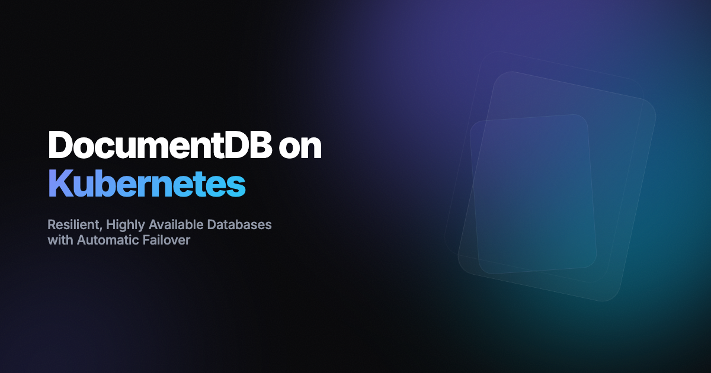

# Deploy a Highly Available DocumentDB cluster on Kubernetes

This repository contains resources to demonstrate automatic failover in a [DocumentDB](https://github.com/documentdb/documentdb) cluster using the [DocumentDB Kubernetes Operator](https://github.com/documentdb/documentdb-kubernetes-operator).

Database high availability is critical for production workloads. When the primary database instance fails, your application needs automatic recovery without manual intervention. This tutorial demonstrates how DocumentDB's local HA feature handles primary failures with minimal downtime and no/minimal client reconfiguration.

📖 **For complete setup instructions, architecture details, and step-by-step guidance, read the full blog post:**

https://dev.to/abhirockzz/documentdb-on-kubernetes-resilient-highly-available-databases-with-automatic-failover-ak7

☝️ The blog post covers the architecture overview and how failover works, includes a detailed walkthrough with expected outputs, and explains automatic recovery.

## Learn More

📚 [DocumentDB Kubernetes Operator Documentation](https://documentdb.github.io/documentdb-kubernetes-operator/)  
💬 [Join the Community on Discord](https://discord.gg/e7vkvuCA)  
🐛 [Report Issues on GitHub](https://github.com/documentdb/documentdb-kubernetes-operator/issues)

### Advanced Scenarios

- [Multi-region deployments](https://github.com/documentdb/documentdb-kubernetes-operator/tree/main/documentdb-playground/aks-fleet-deployment)
- [Multi-cloud configurations](https://github.com/documentdb/documentdb-kubernetes-operator/tree/main/documentdb-playground/multi-cloud-deployment)
